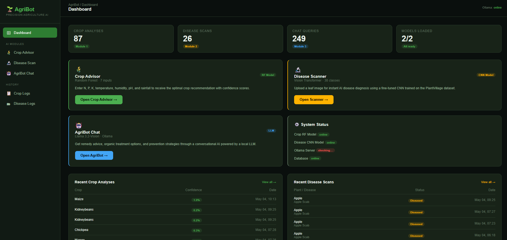
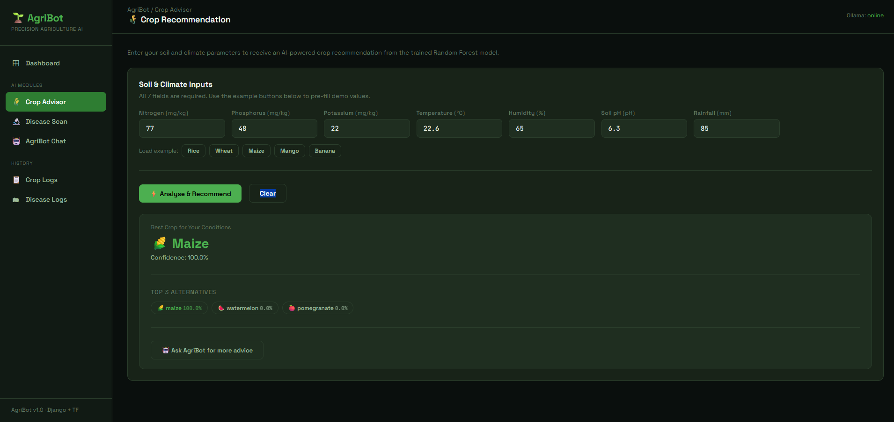
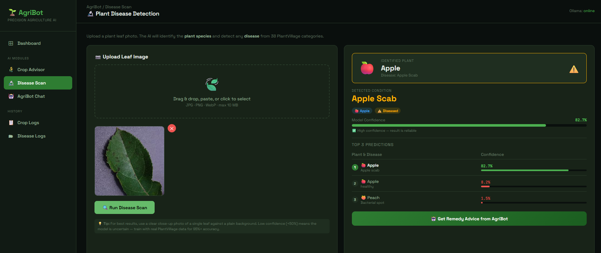
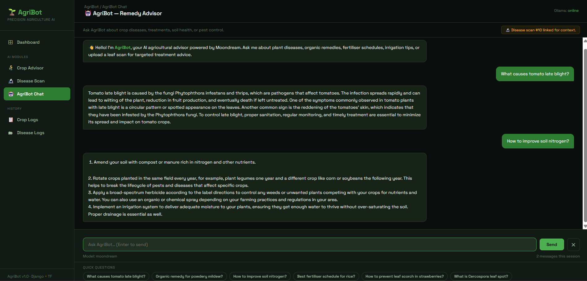

# 🌾 AgriBot — Precision Agriculture AI System
## Complete End-to-End AI-Powered Farming Suite

---

## ✨ Empowering Agriculture Through Intelligent Automation

**AgriBot** isn't just a collection of scripts; it's a comprehensive, production-ready Precision Agriculture ecosystem. By fusing classic Machine Learning, Deep Computer Vision, and Local Large Language Models (LLMs), AgriBot provides farmers, agronomists, and researchers with a unified dashboard to optimize crop yields, diagnose plant pathologies instantly, and receive real-time organic treatment remedies.

Built entirely using **Django**, **TensorFlow**, **Scikit-Learn**, and **Ollama**, this platform demonstrates how heterogeneous AI models can be orchestrated behind a single, cohesive, modern dark-mode user interface.

---

## 🖼️ Interface & Module Walkthrough

### 📊 Central Dashboard
The central command hub provides a macro view of system analytics, real-time inference counters, loaded models, and historical logs at a glance.


### 🌾 Module 1: Crop Recommendation Advisor
Utilizes an optimized Random Forest architecture processing 7 distinct soil and climatic parameters to recommend the most viable crop with precise confidence percentages.


### 🔬 Module 2: Neural Plant Disease Scanner
Powered by a deep Convolutional Neural Network (CNN) trained on the PlantVillage dataset. It screens for 38 distinct health classes across multiple plant species, delivering instant diagnostic breakdowns.


### 🤖 Module 3: AgriBot Chat — Remedy Advisor
An interactive, local conversational agent utilizing advanced Vision-LLMs to assist users with organic remedies, soil amendment strategies, and historical scan contextualization.


---

## 🛠️ System Architecture Summary

## Prerequisites
- Python 3.10+
- Node.js (optional, for asset bundling)
- [Ollama](https://ollama.ai) installed locally (for Module 3 chat)
- NVIDIA GPU recommended for TensorFlow training (CPU works but is slow)

---

## Step 1 — Project setup

```bash
# Clone the repository and navigate to the project directory
git clone [https://github.com/Puneetas015/AgriBot.git](https://github.com/Puneetas015/AgriBot.git)
cd agribot_project

# Establish an isolated virtual environment
python -m venv venv
source venv/bin/activate       # On Windows use: venv\Scripts\activate

# Install all foundational and core AI packages
pip install -r requirements.txt

# Apply schema migrations to the local database
python manage.py makemigrations core
python manage.py migrate

# Establish administrative backend control
python manage.py createsuperuser

# Aggregate static visual assets
python manage.py collectstatic --noinput
```

---

## Step 2 — Train Module 1 (Crop Recommendation)

1) Download the target dataset from Kaggle: Crop Recommendation Dataset.
2) Position the source file exactly at: data/Crop_recommendation.csv.
3) Execute the training script to construct your Random Forest artifacts:

```bash
python crop_recommendation/train_model.py
```
Generated Artifacts: ```core/ml_models/crop_rf_model.pkl```, ``` core/ml_models/label_encoder.pkl```

---

## Step 3 — Train Module 2 (Disease Detection)

1) Download the global dataset: kaggle datasets download -d abdallahalidev/plantvillage-dataset.
2) Extract the directories directly into: data/plantvillage/ (organized with sub-folders representing individual target classes).
3) Execute the deep neural pipeline:
```bash
python disease_detection/train_cnn.py
```
Target Benchmarks: Expected accuracy of ~95%+ Top-1, and ~99%+ Top-3 metrics on validation groups.
Generated Artifacts: ```core/ml_models/disease_model.h5```, ```disease_detection/class_names.py```

---

## Step 4 — Bootstrapping Local LLM Server (Module 3 Chat)

```bash
# Download and initialize the Ollama environment
# Reference: [https://ollama.ai/download](https://ollama.ai/download)

# Fetch the optimized vision-language model parameters
ollama pull llama3.2-vision

# Spin up the localized model server (Defaults to Port 11434)
ollama serve
```

---

## Step 5 — Run AgriBot

```bash
python manage.py runserver
Navigate your web engine browser to: http://127.0.0.1:8000
```

---

## Environment variables (optional `.env`)

```
DJANGO_SECRET_KEY=your-secret-key-here
DEBUG=True
OLLAMA_URL=http://localhost:11434
OLLAMA_MODEL=llama3.2-vision
```

---

## Architecture summary

```
Browser (AJAX/Fetch)
        │
        ▼
Django views.py
   ├── /api/crop/predict/     → joblib RF model → CropPrediction DB
   ├── /api/disease/predict/  → TF/Keras CNN    → DiseasePrediction DB
   └── /api/chat/             → requests → Ollama → ChatMessage DB
```

---

## Admin panel

Visit `http://127.0.0.1:8000/admin/` to browse all prediction history.

---

## Troubleshooting

| Issue | Fix |
|---|---|
| `RF model not found` | Run `train_model.py` first |
| `CNN model not found` | Run `train_cnn.py` first |
| `Cannot connect to Ollama` | Run `ollama serve` in a separate terminal |
| TF OOM error | Reduce `BATCH_SIZE` in `train_cnn.py` |
| CSRF error on API | Ensure `X-CSRFToken` header is sent (already handled in JS) |
